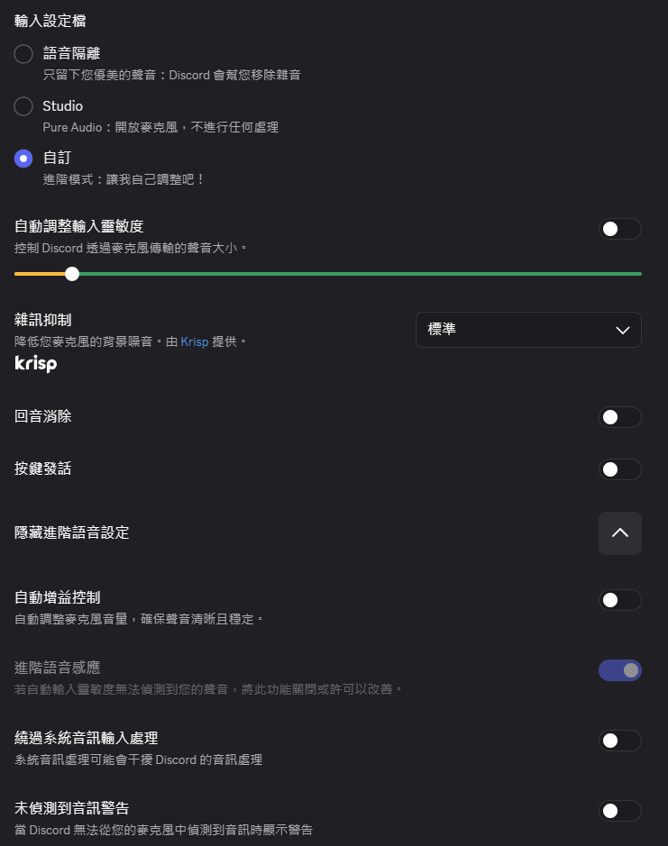
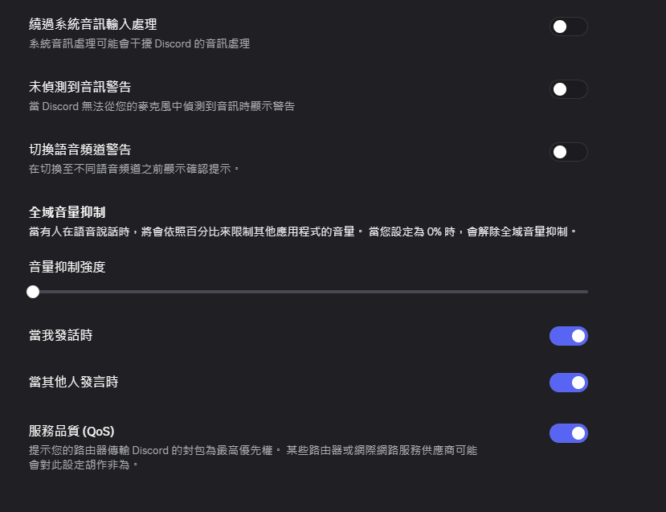

# KTISV — 實時虛擬聲卡軟體

## 前言

這是個大約前幾周[胡亂]答應朋友的製作的軟體,在喝醉的情況下就做出來了,並交由現在**清醒**的我進行發行及宣布

## 特色

- **幾乎**無延遲的播放歌曲
- **無限制**取用youtube曲庫
- **低效能**基本不限配置運行,讓點腦無負擔
- **簡潔快速**的安裝流程,低操作成本

## 安裝方式

### VB-Cable(聲音驅動,很重要)

#### 連結：https://vb-audio.com/Cable/index.htm

點進去網站中點擊**windows**圖案進行下載,並運行VB_Cable_Setup_x64後進行安裝,即可使用

### KTISV(軟體本體) Beta v0.0.1

#### 連結：:https://reurl.cc/nxOVl2

點進去之後下載壓縮包並解壓縮在想要的位置即可,運行 **KTISV.exe** 即可

> 解壓後應該會看到 `KTISV.exe` 和旁邊一個 `engine-bin\` 資料夾。
> **兩個要放在一起**,`engine-bin\` 是音訊引擎,少了它程式會開起來但沒有聲音。

## 使用方式
### Youtube 搜尋Page

- 搜尋
    
        輸入關鍵字會啟動Youtube搜尋,直接輸入網址會直接撥放歌曲
        點[+歌單]會將歌曲放入到歌單
        內部

- 歌詞

        默認抓取字幕為中文,如果沒有則遞延,但字幕抓取依據為CC字幕,因此如果為特殊字幕會導致亂碼

- 歌單

        從搜尋抓取歌曲會依序撥放,按播放鍵會立即撥放,且可設定循環或非循環

### 卡拉OK設定

> **關於裝置清單裡同一支耳機出現好幾次。**
> 那是 Windows 的三種音訊介面:**MME**、**DirectSound**、**WASAPI**。
> 名字看起來一樣,延遲差很多 —— 同一支耳麥實測 MME 約 90 ms、
> DirectSound 約 120 ms、**WASAPI 只有 3 ms**。
> **一律選有 WASAPI 字樣的那一個。** 選錯的話,底下再怎麼調都是白費工。
> 軟體偵測到你選了高延遲的那種時會在畫面上提醒。

- 影片音源

    - 人曲分離
            
            可以透過區域進行人聲分離出歌曲與純人聲,並有不同的引擎進行分離調校,下面四個拉條進行分離的模型微調
    
    - 歌曲 Key(升 key / 降 key)

            歌太高唱不上去、太低唱不到,就用這個把歌搬到你的音域
            [♭] 降半音   [♯] 升半音   [原調] 歸零,下面的拉條也可以直接拉
            只會改音樂,你自己的聲音不會被改,速度也不變
            超過 ±5 個半音之後會開始聽得出處理痕跡(鼓跟鈸最明顯)
            原調時完全不佔資源;開起來會讓音樂多約 41 ms 延遲,
            但你跟對方聽到的相對時間不變,DC延遲不用重調

    - 音樂音量

            音樂音量調鈕為總音量,可以針對:
            1.耳機輸出
            2.DC輸出(麥克風)
            進行調節,並進行細部調節

    - DC延遲

            負責調節推送到DC所合成的音樂人聲延遲(如果懶得條直接按[套用建議值])
            拉條旁邊的欄位可以直接打數字(0～500 ms),打完按 Enter 就生效,
            要對準拍子時比拉條準得多

- 麥克風

    - 輸入裝置
            
            軟體接收你聲音的裝置,請選擇你唱歌的麥克風裝置(正常會自動選取)

    內部同樣可以調節大小聲並透過聆聽進行測試

    - 回音(ECHO)

            卡拉OK機的回音旋鈕,預設關閉(唱歌好聽,講話會變得難聽懂)
            打勾之後下面四條才會亮:
            回音時間 = 每次重複相隔多久
            重複次數 = 尾巴拖多長
            回音量   = 混進去多少
            高頻衰減 = 每次重複暗一點,越像真的空間;調 0 會很像金屬罐
            自己耳機跟DC那邊聽到的是同一份效果

- 兩路輸出
    - 耳機
        
            請設定自己的耳機進行聆聽音樂及所有聲音
    
    - 虛擬麥克風

            用來透過mic進行語音輸出,請選擇Cable Input
### EQ調整

上面那組管影片/音樂,下面那組管你的麥克風,兩組互不影響。

推桿是增益(±15 dB)。推桿底下兩個小欄位是這一段的**頻率**跟 **Q**,
可以直接打數字(頻率能寫成「1.5k」),打完按 Enter 或點到別處才會送出。

- **＋ 新增頻段**:加一段,會自動落在目前間隔最大的地方,最多 24 段
- **✕ 刪除**:把那一段拿掉(至少要留一段)
- 最左跟最右那兩段是 shelf(從那裡開始整片抬高或壓低),中間都是 peaking(只動那一小塊)
- Q 在 peaking 上是「影響範圍多窄」,在 shelf 上是「轉折多陡」

上排的人聲/電話/微笑曲線會依每段目前的頻率重新取值,所以自己改過頻段之後照樣能用。
邊播邊改不會有爆音。

### 其他設定

這一頁有整個軟體**最有感的一個開關**,不要跳過。

- **WASAPI 獨佔模式**

        耳返延遲的最大關鍵。開發機上實測 51.5 ms → 13.2 ms,差距比底下所有
        調整加起來還大。代價是那些裝置會被本程式獨佔,其他程式(包括 DC
        自己的提示音)發不出聲音 —— 唱歌時通常無所謂,要聽別的就關掉。
        裝置不支援時會自動退回共享模式,並在畫面上說明原因。

- **緩衝大小**

        不是越小越好。太小會掉幀(爆音),看狀態列的 xrun 數字:
        會跳就往上調一級。開了變調之後尤其要注意。

- **開始自動調校**

        懶得自己試就按這個。它會在你這台機器上把各種組合實際跑一遍,
        挑出不掉幀的最低延遲再自動套用。過程中聲音會斷斷續續,那是正常的。
        需要同時選好麥克風與耳機。

- **語言**

        繁體中文 / English,切換後立即生效。

- **儲存目前設定**

        ⚠️ 目前是**單向**的:按下去會存檔,但重開程式不會自動載回來。
        語言、緩衝大小、獨佔模式這三項是另一套機制,重開會記得。

- **記錄**

        出問題時先看這裡,引擎的錯誤訊息都會出現在這一欄。

---

## Discord 設定

軟體這側設好之後,DC 那側還要做兩件事,少一件對方就聽不到歌。

- **輸入裝置選 `Cable Output`**

        注意是 Output 不是 Input。KTISV 把聲音送進 Cable Input,
        DC 要從線的另一頭 Cable Output 把它收回來。

- **關掉回音消除與噪音抑制**

        這兩個功能會把音樂當成噪音削掉,對方聽到的歌會斷斷續續。
        依照下圖設定:

---

## 常見問題

**DC 那邊聽不到我的歌**

        先看 KTISV 裡「虛擬麥克風輸出」的電平表有沒有在動。
        有動 = KTISV 這側正常,問題在 DC 的輸入裝置選錯(要選 Cable Output)。
        沒動 = 檢查「虛擬麥克風」有沒有選成 Cable Input。

**對方聽到的歌斷斷續續**

        DC 的「回音消除」和「噪音抑制」把音樂當成噪音削掉了,
        在 DC 的語音設定裡關掉這兩個。

**我自己的耳機突然沒聲音 / 對方聽得到我的瀏覽器**

        VB-Cable 裝完會把 Windows 的預設輸出搶走。
        設定 → 系統 → 音效 → 輸出,改回你的耳機。

**破音**

        先把「總輸出」拉低,不要把各路推桿拉高。

**用喇叭時一直嘯叫**

        關掉「聆聽自己的聲音」。用喇叭時麥克風會收到自己的聲音再放大,
        這是回授,不是軟體壞掉。

**唱不上去 / 太低**

        卡拉OK設定頁的「歌曲 Key」按 ♭ 或 ♯,把歌搬到你的音域。
        只會改音樂,你的聲音不會被改。

**歌聲跟音樂沒對上(對方說的)**

        調「DC 延遲」,或直接按「套用建議值」。
        這是因為你是跟著耳機裡的音樂唱的,歌聲天生就比音樂晚一個耳返延遲。